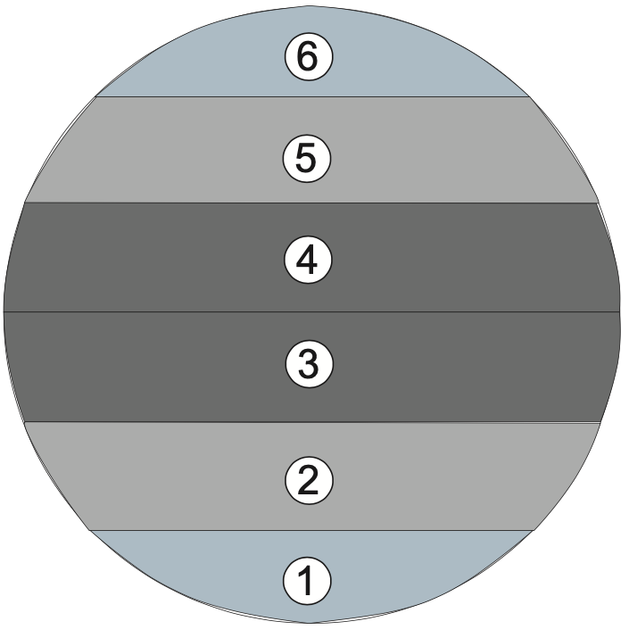
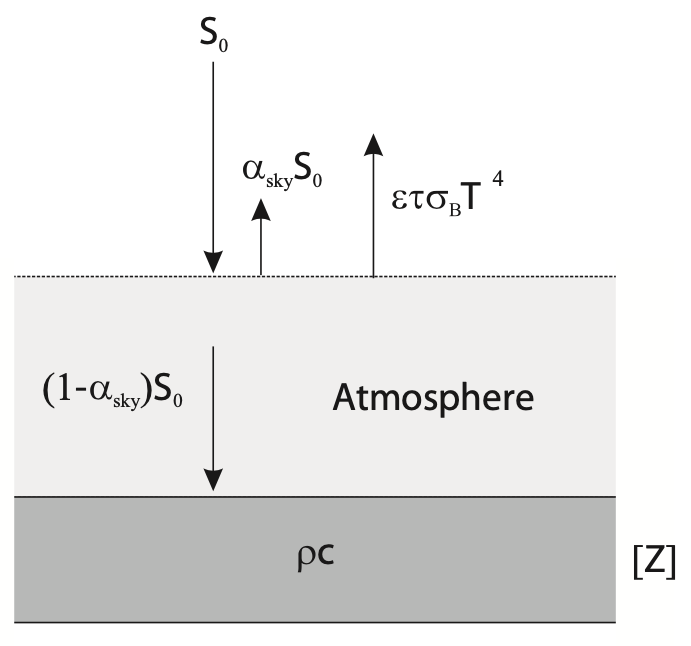

<h1>Volcanic Eruptions</h1>
<h3>EOSC 453 Assignment 2: Volcanic Eruptions and Climate Change</h3>
 

This assignment investigates the effects of volcanism on Earth's climate
through a radiative energy balance box model. The box model consists of
6 zones where Earth is divided into a set of latitude-dependent bands.

 

    

 
 

    

